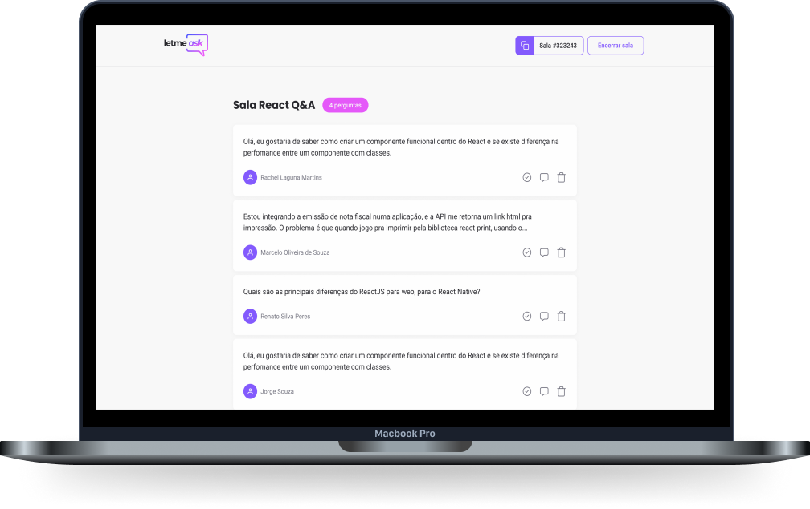

<h1 align="center">
  
</h1>
<br />

<p align="center">
  <a href="#-sobre-o-projeto">Sobre o projeto</a>&nbsp;&nbsp;&nbsp;|&nbsp;&nbsp;&nbsp;
  <a href="#-construído-utilizando">Construído utilizando</a>&nbsp;&nbsp;&nbsp;|&nbsp;&nbsp;&nbsp;
  <a href="#-como-utilizar">Como utilizar</a>&nbsp;&nbsp;&nbsp;|&nbsp;&nbsp;&nbsp;
  <a href="#-como-contribuir">Como contribuir</a>&nbsp;&nbsp;&nbsp;|&nbsp;&nbsp;&nbsp;
  <a href="#-licença">Licença</a>
</p>

<br/>
<div align="center">
  <a href="https://github.com/ViniciusMazon/LetMeAsk"></a>
</div>
<br/>
<br/>
<div align="center">
  
</div>
<br/>

# Sobre o projeto

O LetMeAsk é uma plataforma de perguntas e respostas dedicada a criadores de conteúdo que são bombardeados com perguntas em suas transmissões. O LetMeAsk permite que a comunidade vote nas perguntas mais relevantes, bem como permite que o administrador da sala destaque e apague perguntas.

Projeto desenvolvido durante a NLW 6, evento da [Rocketseat](https://github.com/rocketseat-education)💜.

Demo: https://letmeask-b3b02.web.app/
Vídeo demo: https://youtu.be/CGSconZTE2Q

# 🔬 Construído utilizando

* [react](https://pt-br.reactjs.org/)
* [sass](https://sass-lang.com/)
* [react-router-dom](https://reactrouter.com/web/guides/quick-start)
* [firebase](https://console.firebase.google.com/)
* [react-hot-toast](https://react-hot-toast.com/)
* [classnames](https://www.npmjs.com/package/classnames)
</br>

# ⚙️ Como utilizar

Clone o repositório:

```bash
git clone https://github.com/ViniciusMazon/LetMeAsk.git
```

Instale as dependência rodando dentro do diretório criado, rodando:
```
yarn
```
Rode o projeto utilizando o script:
```
yarn start
```
</br>

# 🖖🏻 Como contribuir

- Faça um fork desse repositório;
- Clone esse repositório em sua máquina: git clone `https://github.com/ViniciusMazon/LetMeAsk.git`
- Cria uma branch com a sua feature: `git checkout -b minha-feature`;
- Faça o commit dos testes: `git commit -m 'test: Nome do teste'`;
- Faça commit das suas alterações: `git commit -m 'feat: Minha nova feature'`;
- Faça push para a sua branch: `git push origin minha-feature`.

Depois que o merge da sua pull request for feito, você pode deletar a sua branch.
</br>

# 📃 Licença

Esse projeto está sob a licença MIT. Veja o arquivo LICENSE para mais detalhes.

---

Feito com 🖤 por Vinicius Mazon.
